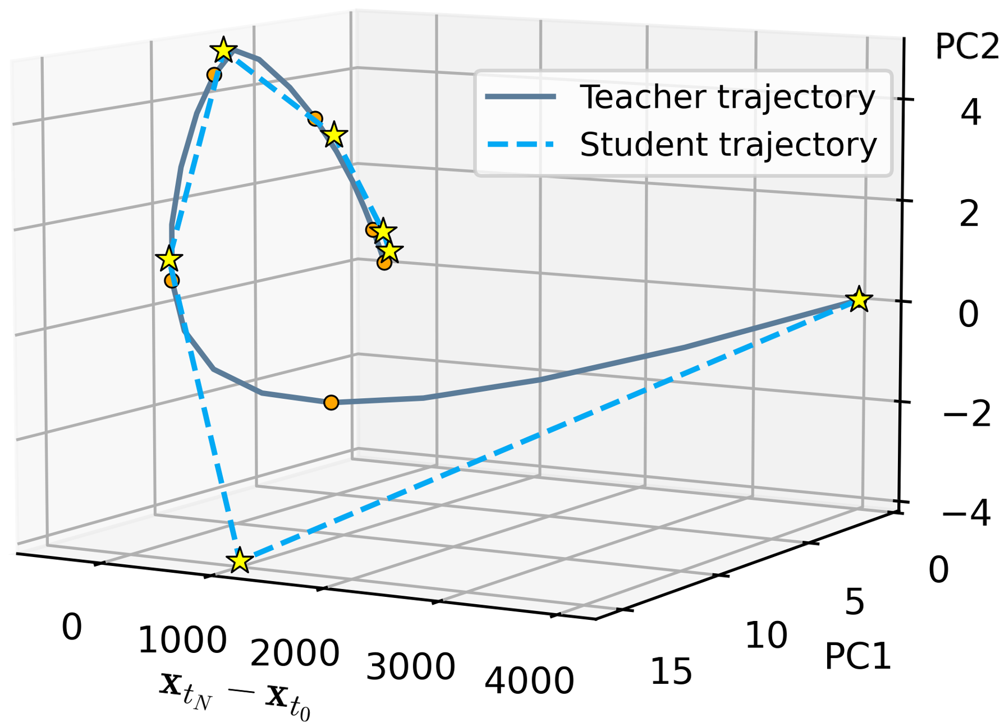
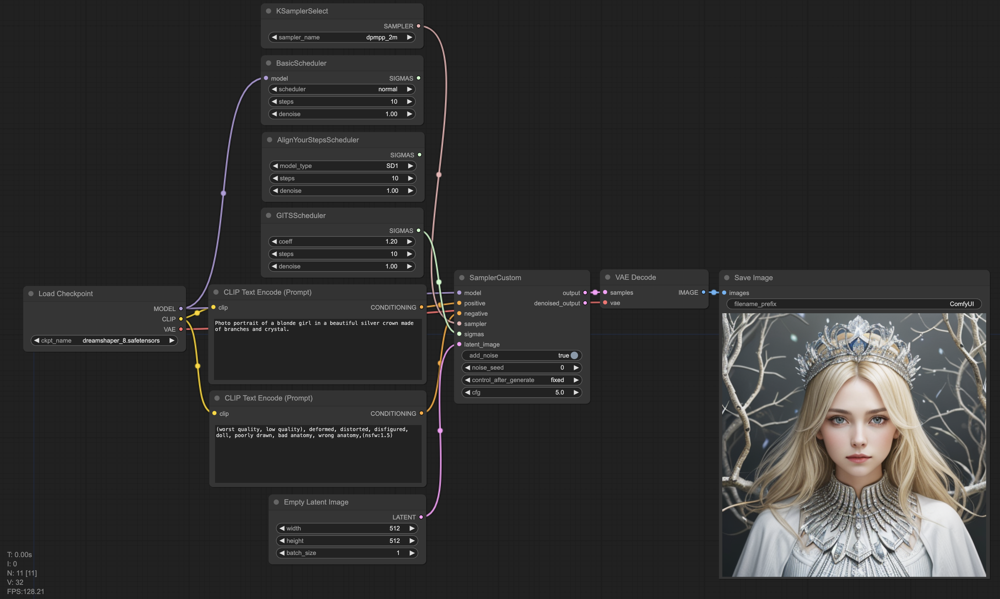
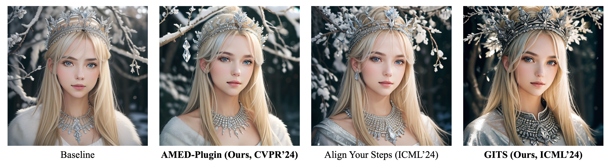

# diff-sampler
diff-sampler is an open-source toolbox for fast sampling of diffusion models, providing a fair comparison of existing approaches and help researchers develp better approaches. diff-sampler contains various model implementations, numerical-based solvers, time schedules, and other features.  

This repository also includes (or will include) the official implementations of our following works:

- [x] [arXiv 2023] [A Geometric Perspective on Diffusion Models](https://arxiv.org/abs/2305.19947)
- [x] [CVPR 2024] [Fast ODE-based Sampling for Diffusion Models in Around 5 Steps](https://arxiv.org/abs/2312.00094)
- [x] [ICML 2024] [On the Trajectory Regularity of ODE-based Diffusion Sampling](https://arxiv.org/abs/2405.11326)
- [x] [NeurIPS 2024] [Simple and Fast Distillation of Diffusion Models](https://arxiv.org/abs/2409.19681)

## News
- **2024-11-13**. The official implementation of the paper [Simple and Fast Distillation of Diffusion Models](https://arxiv.org/abs/2409.19681) is released in [sfd-main](./sfd-main/). We simplify and accelerate the distillation of Diffusion Models. The proposed method accelerates the fine-tuning up to 1,000 times while preserving high-quality few-step image generation. 
  <div style="display: flex; justify-content: center;">
    
    
  </div>
- **2024-10-01**. Our new work [Simple and Fast Distillation of Diffusion Models](https://arxiv.org/abs/2409.19681) is accepted by NeurIPS 2024! We will release the code as soon as possible.
- **2024-09-12**. We release diff-analyzer as an easy toolbox for analyzing the behavior of the sampling of diffusion models. We offer the code for reproducing some observations in our works [A Geometric Perspective on Diffusion Models](https://arxiv.org/abs/2305.19947) and [On the Trajectory Regularity of ODE-based Diffusion Sampling](https://arxiv.org/abs/2405.11326). <div style="text-align: center;"></div>
- **2024-06-20**. GITS is integrated into [ComfyUI](https://github.com/comfyanonymous/ComfyUI) as [GITSScheduler](https://github.com/comfyanonymous/ComfyUI/blob/master/comfy_extras/nodes_gits.py)! We provide a [ComfyUI workflow](./assets/workflow-gits.json) to compare GITS with the baseline time schedule and the concurrent ICML 2024 paper [Align Your Steps: Optimizing Sampling Schedules in Diffusion Models](https://arxiv.org/abs/2404.14507). More details are included in our pull request [here](https://github.com/comfyanonymous/ComfyUI/pull/3769). <div style="text-align: center;"></div>
- **2024-06-18**. The official implementation of the paper [On the Trajectory Regularity of ODE-based Diffusion Sampling](https://arxiv.org/abs/2405.11326) is released in [gits-main](./gits-main/). 
  - This new repo is built on the basis of [diff-solvers-main](./diff-solvers-main/), supporting baseline sampling as well as customized time schedule. Our method (GITS) offers a more efficient time schedule for fast sampling of diffusion models.
  - For text-to-image generation, we provide a [colab script](https://colab.research.google.com/drive/1dxyVyI9SBozYcfS5bUNxKCjaTxPrdWSr?usp=sharing) using Diffusers 🧨 where we also compare our methods with the concurrent work [Align Your Steps](https://research.nvidia.com/labs/toronto-ai/AlignYourSteps/). Below is a 10-step comparison.
  
- **2024-06-03**. The repo is made easier to use. Now the pre-trained models will be automatically downloaded to `./src/dataset_name`. Some errors and typos are fixed. Detailed running scripts are provided in `launch.sh`, where we also add new scripts for evaluation of CLIP score for Stable Diffusion.
- **2024-05-02**. Our work [On the Trajectory Regularity of ODE-based Diffusion Sampling](https://arxiv.org/abs/2405.11326) is accepted by ICML 2024.
- **2024-04-05**. Our work [Fast ODE-based Sampling for Diffusion Models in Around 5 Steps](https://arxiv.org/abs/2312.00094) is selected as a **Highlight** paper (Top 2.8%) by CVPR 2024!
- **2024-03-25**. The official implementation of the paper [Fast ODE-based Sampling for Diffusion Models in Around 5 Steps](https://arxiv.org/abs/2312.00094) ([amed-solver-main](./amed-solver-main/)) and a toolbox ([diff-solvers-main](./diff-solvers-main/)) for fast sampling of diffusion models is released. We upload the reference statistics for FID evaluation [here](https://drive.google.com/drive/folders/1f8qf5qtUewCdDrkExK_Tk5-qC-fNPKpL?usp=sharing). Hope that this repo can facilitate researchers on fast sampling of diffusion models!
- **2024-02-27**. Our work [Fast ODE-based Sampling for Diffusion Models in Around 5 Steps](https://arxiv.org/abs/2312.00094) is accepted by CVPR 2024.

## Supported Fast Samplers for Diffusion Models
| Name | Max Order | Source | Location |
|------|-----------|--------|----------|
|Euler|1|[Denoising Diffusion Implicit Models](https://arxiv.org/abs/2010.02502)|[diff-solvers-main](./diff-solvers-main/)|
|Heun|2|[Elucidating the Design Space of Diffusion-Based Generative Models](https://arxiv.org/abs/2206.00364)|[diff-solvers-main](./diff-solvers-main/)|
|DPM-Solver-2|2|[DPM-Solver: A Fast ODE Solver for Diffusion Probabilistic Model Sampling in Around 10 Steps](https://arxiv.org/abs/2206.00927)|[diff-solvers-main](./diff-solvers-main/)|
|DPM-Solver++|3|[DPM-Solver++: Fast Solver for Guided Sampling of Diffusion Probabilistic Models](https://arxiv.org/abs/2211.01095)|[diff-solvers-main](./diff-solvers-main/)|
|UniPC|3|[UniPC: A Unified Predictor-Corrector Framework for Fast Sampling of Diffusion Models](https://proceedings.neurips.cc/paper_files/paper/2023/hash/9c2aa1e456ea543997f6927295196381-Abstract-Conference.html)|[diff-solvers-main](./diff-solvers-main/)|
|DEIS|4|[Fast Sampling of Diffusion Models with Exponential Integrator](https://arxiv.org/abs/2204.13902)|[diff-solvers-main](./diff-solvers-main/)|
|iPNDM|4|[Fast Sampling of Diffusion Models with Exponential Integrator](https://arxiv.org/abs/2204.13902)|[diff-solvers-main](./diff-solvers-main/)|
|iPNDM_v|4|The variable-step version of the Adams–Bashforth methods|[diff-solvers-main](./diff-solvers-main/)|
|AMED-Solver|2|[Fast ODE-based Sampling for Diffusion Models in Around 5 Steps](https://arxiv.org/abs/2312.00094)|[amed-solver-main](./amed-solver-main/)|
|AMED-Plugin|-|[Fast ODE-based Sampling for Diffusion Models in Around 5 Steps](https://arxiv.org/abs/2312.00094)|[amed-solver-main](./amed-solver-main/)|
|GITS|-|[On the Trajectory Regularity of ODE-based Diffusion Sampling](https://arxiv.org/abs/2405.11326)|[gits-main](./gits-main/)|


## Citation
If you find this repository useful, please consider citing the following paper (reverse chronological order):

```bibtex

@article{zhou2024simple,
  title={Simple and Fast Distillation of Diffusion Models},
  author={Zhou, Zhenyu and Chen, Defang and Wang, Can and Chen, Chun and Lyu, Siwei},
  journal={arXiv preprint arXiv:2409.19681},
  year={2024}
}

@article{chen2024trajectory,
  title={On the Trajectory Regularity of ODE-based Diffusion Sampling},
  author={Chen, Defang and Zhou, Zhenyu and Wang, Can and Shen, Chunhua and Lyu, Siwei},
  journal={arXiv preprint arXiv:2405.11326},
  year={2024}
}

@article{zhou2023fast,
  title={Fast ODE-based Sampling for Diffusion Models in Around 5 Steps},
  author={Zhou, Zhenyu and Chen, Defang and Wang, Can and Chen, Chun},
  journal={arXiv preprint arXiv:2312.00094},
  year={2023}
}

@article{chen2023geometric,
  title={A geometric perspective on diffusion models},
  author={Chen, Defang and Zhou, Zhenyu and Mei, Jian-Ping and Shen, Chunhua and Chen, Chun and Wang, Can},
  journal={arXiv preprint arXiv:2305.19947},
  year={2023}
}

```


## Star History

[](https://star-history.com/#zju-pi/diff-sampler&Date)
