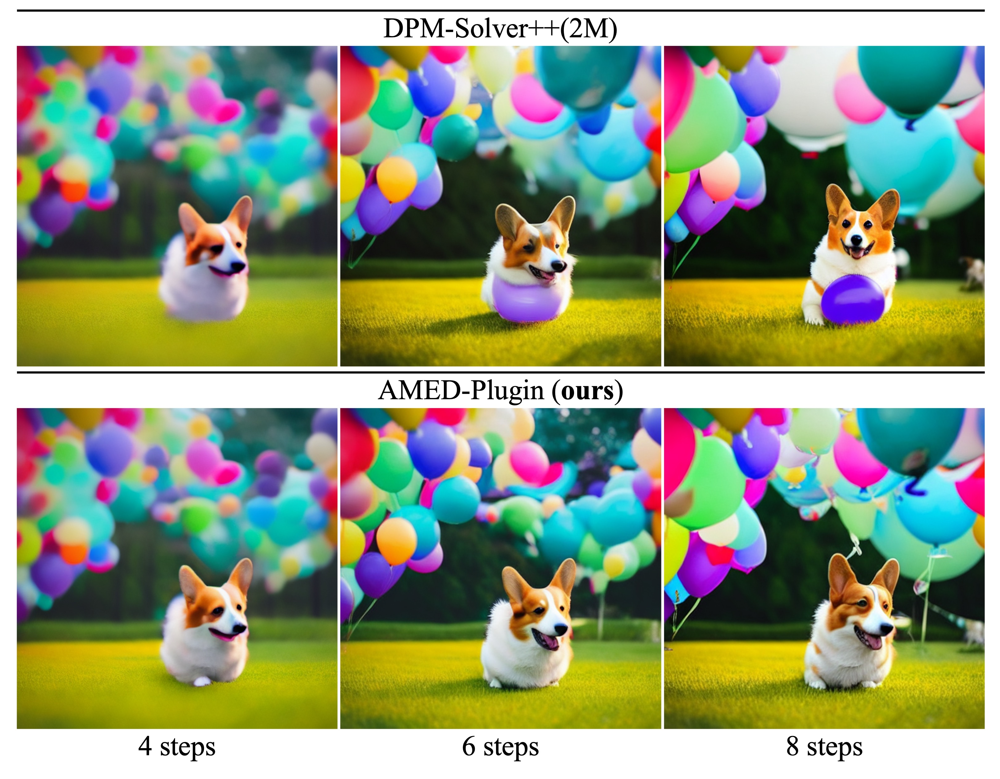
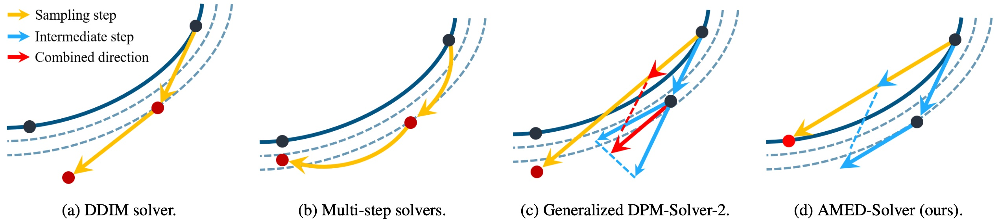
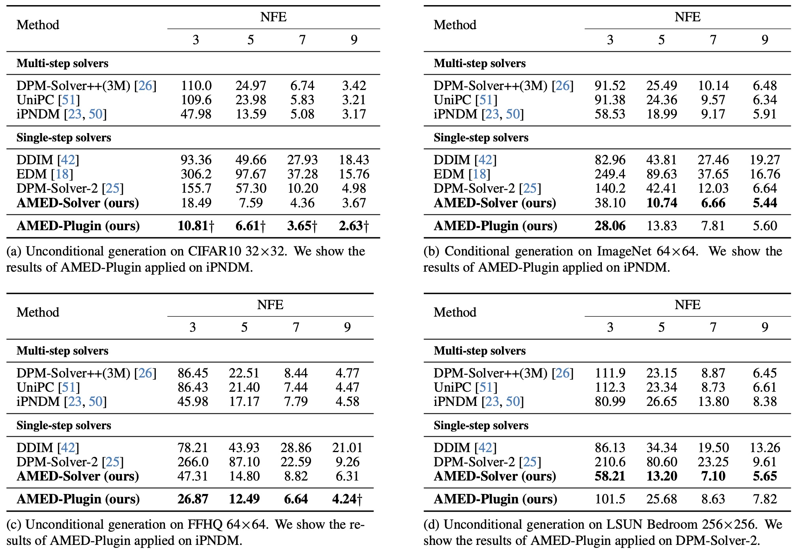

## Fast ODE-based Sampling for Diffusion Models in Around 5 Steps<br><sub>Official implementation of the CVPR 2024 paper</sub>



**Fast ODE-based Sampling for Diffusion Models in Around 5 Steps**<br>
Zhenyu Zhou, Defang Chen, Chun Chen, Can Wang
<br>https://arxiv.org/abs/2312.00094<br>

**Abstract**: Sampling from diffusion models can be treated as solving the corresponding ordinary differential equations (ODEs), with the aim of obtaining an accurate solution with as few number of function evaluations (NFE) as possible. Recently, various fast samplers utilizing higher-order ODE solvers have emerged and achieved better performance than the initial first-order one. However, these numerical methods inherently result in certain approximation errors, which significantly degrades sample quality with extremely small NFE (e.g., around 5). In contrast, based on the geometric observation that each sampling trajectory almost lies in a two-dimensional subspace embedded in the ambient space, we propose **A**pproximate **ME**an-**D**irection Solver (AMED-Solver) that eliminates truncation errors by directly learning the mean direction for fast diffusion sampling. Besides, our method can be easily used as a plugin to further improve existing ODE-based samplers. Extensive experiments on image synthesis with the resolution ranging from 32 to 512 demonstrate the effectiveness of our method. With only 5 NFE, we achieve 6.61 FID on CIFAR-10, 10.74 FID on ImageNet 64x64, and 13.20 FID on LSUN Bedroom. 



## Requirements
- This codebase mainly refers to the codebase of [EDM](https://github.com/NVlabs/edm). To install the required packages, please refer to the [EDM](https://github.com/NVlabs/edm) codebase.
- This codebase supports the pre-trained diffusion models from [EDM](https://github.com/NVlabs/edm), [ADM](https://github.com/openai/guided-diffusion), [Consistency models](https://github.com/openai/consistency_models), [LDM](https://github.com/CompVis/latent-diffusion) and [Stable Diffusion](https://github.com/CompVis/stable-diffusion). When you want to load the pre-trained diffusion models from these codebases, please refer to the corresponding codebases for package installation.

## Getting Started
Run the command below to train the AMED predictor specified settings. This command can be parallelized across multiple GPUs by adjusting ```--nproc_per_node```. You can find the descriptions to all the parameters in the next section.
```.bash
# Train the AMED predictor
SOLVER_FLAGS="--sampler_stu=ipndm --sampler_tea=ipndm --num_steps=4 --M=2 --afs=True --max_order=4"
SCHEDULE_FLAGS="--schedule_type=polynomial --schedule_rho=7"
ADDITIONAL_FLAGS="--max_order=4"
GUIDANCE_FLAGS=""
torchrun --standalone --nproc_per_node=1 train.py \
--dataset_name="name of the dataset" \
--model_path="/path/to/your/model" \
--batch=64 \
--total_kimg=10 \
--scale_time=True \
$SOLVER_FLAGS \
$SCHEDULE_FLAGS \
$ADDITIONAL_FLAGS \
$GUIDANCE_FLAGS
```

After finishing the training, the AMED predictor will be saved at "./exps" with a five digit experiment number (e.g. 00001) by default. The setting of the solver for sampling is stored in the predictor. You can perform accelerated sampling with the trained AMED predictor by inputting the path or the exp number (e.g. 1) of the AMED predictor in ```--predictor_path```:
```.bash
torchrun --standalone --nproc_per_node=1 sample.py \
--predictor_path="/path/or/exp/number/of/AMED/predictor" \
--model_path="/path/to/your/model" \
--dataset_name="name of the dataset" \
--batch=64 \
--seeds="0-49999" \
```

To compute Fréchet inception distance (FID) for a given model and sampler, first generate 50000 random images and then compare them against the dataset reference statistics using ```fid.py```:
```.bash
# FID evaluation
python fid.py calc --images=path/to/images --ref=path/to/fid/stat
```

## Description of Parameters
| Name | Paramater | Default | Description |
|------|-----------|---------|-------------|
|General options|dataset_name|None|One in ['cifar10', 'ffhq', 'imagenet64', 'lsun_bedroom', 'lsun_cat', 'imagenet256', 'lsun_bedroom_ldm', 'ms_coco']|
|               |predictor_path|None|Path or the experiment number of the trained AMED predictor|
|               |model_path|None|Path to the pre-trained diffusion models|
|               |batch|64|Total batch size|
|               |seeds|0-63|Specify a different random seed for each image|
|               |grid|False|Organize the generated images as grid|
|               |total_kimg|10|Total training images (k)|
|               |scale_time|False|Whether to train an additional parameter to scale the input time in the diffusion models|
|SOLVER_FLAGS|sampler_stu|'amed'|Student solver. One in ['amed', 'dpm', 'dpmpp', 'euler', 'ipndm']|
|            |sampler_tea|'heun'|Teacher solver. One in ['heun', 'dpm', 'dpmpp', 'euler', 'ipndm']|
|            |num_steps|4|Number of timestamps for the student solver. **When num_steps=N, there will be finally 2(N-1) sampling steps since the AMED predictor will insert one intermediate step between two adjacent steps for the student solver**. The exact NFE depends on the chosen solver|
|            |M|1|How many intermediate time steps to insert between two adjacent steps for the teacher solver|
|            |afs|False|Whether to use AFS which saves the first model evaluation|
|SCHEDULE_FLAGS|sigma_min|0.002|Lowest noise level. Specified when loading the pre-trained models|
|              |sigma_max|80.|Highest noise level. Specified when loading the pre-trained models|
|              |schedule_type|'polynomial'|Time discretization schedule. One in ['polynomial', 'logsnr', 'time_uniform', 'discrete']|
|              |schedule_rho|7|Time step exponent. Need to be specified when schedule_type in ['polynomial', 'time_uniform', 'discrete']|
|ADDITIONAL_FLAGS|max_order|None|Option for multi-step solvers. 1<=max_order<=4 for iPNDM, 1<=max_order<=3 for DPM-Solver++|
|                |predict_x0|True|Option for DPM-Solver++. Whether to use the data prediction formulation.|
|                |lower_order_final|True|Option for DPM-Solver++. Whether to lower the order at the final stages of sampling.|
|GUIDANCE_FLAGS|guidance_type|None|One in ['cg', 'cfg', 'uncond', None]. 'cg' for classifier-guidance, 'cfg' for classifier-free-guidance used in Stable Diffusion, and 'uncond' for unconditional used in LDM|
|              |guidance_rate|None|Guidance rate|
|              |classifier_path|None|Path to the pre-trained classifier used for classifier-guidance|
|              |prompt_path|None|Path to MS-COCO_val2014_30k_captions.csv for training on Stable Diffusion|

## Performance



## Pre-trained AMED Predictors
For CIFAR-10, FFHQ64 and ImageNet64, we provide our [pre-trained AMED predictors](https://drive.google.com/drive/folders/1KlS0mV3qKMBu1qghy9sXRrjL2Aic4_fN) for AMED-Solver and AMED-Plugin on iPNDM solver for direct sampling. The folder name are organized as '\<exp_num\>-\<dataset_name\>-\<num_steps\>-\<NFE\>-\<student\>-\<teacher\>-\<M\>-\<shcedule\>-\<afs\>'. You can put these folders under `./exp/` and run the sampling script above with the experiment order to perform accelerated sampling.

## Pre-trained Diffusion Models
We perform sampling on a variaty of pre-trained diffusion models from different codebases including
[EDM](https://github.com/NVlabs/edm), [ADM](https://github.com/openai/guided-diffusion), [Consistency models](https://github.com/openai/consistency_models), [LDM](https://github.com/CompVis/latent-diffusion) and [Stable Diffusion](https://github.com/CompVis/stable-diffusion). The tested pre-trained models are listed below:

| Codebase | Dataset | Resolusion | Pre-trained Models | Description |
|----------|---------|------------|--------------------|-------------|
|EDM|CIFAR10|32|[edm-cifar10-32x32-uncond-vp.pkl](https://nvlabs-fi-cdn.nvidia.com/edm/pretrained/edm-cifar10-32x32-uncond-vp.pkl)
|EDM|FFHQ|64|[edm-ffhq-64x64-uncond-vp.pkl](https://nvlabs-fi-cdn.nvidia.com/edm/pretrained/edm-ffhq-64x64-uncond-vp.pkl)
|EDM|ImageNet|64|[edm-imagenet-64x64-cond-adm.pkl](https://nvlabs-fi-cdn.nvidia.com/edm/pretrained/edm-imagenet-64x64-cond-adm.pkl)
|Consistency Models|LSUN_bedroom|256|[edm_bedroom256_ema.pt](https://openaipublic.blob.core.windows.net/consistency/edm_bedroom256_ema.pt)|Pixel-space
|ADM|ImageNet|256|[256x256_diffusion.pt](https://openaipublic.blob.core.windows.net/diffusion/jul-2021/256x256_diffusion.pt) and [256x256_classifier.pt](https://openaipublic.blob.core.windows.net/diffusion/jul-2021/256x256_classifier.pt)|Classifier-guidance.
|LDM|LSUN_bedroom|256|[lsun_bedroom.pt](https://openaipublic.blob.core.windows.net/diffusion/jul-2021/lsun_bedroom.pt) and [vq-f4 model](https://ommer-lab.com/files/latent-diffusion/vq-f4.zip)|Latent-space
|Stable Diffusion|MS-COCO|512|[stable-diffusion-v1-4](https://huggingface.co/CompVis/stable-diffusion-v1-4)|Classifier-free-guidance

Place the downloaded vq-f4 model at `./models/ldm_models/first_stage_models/vq-f4/model.ckpt`

## FID Statistics
For facilitating the FID evaluation of diffusion models, we provide our [FID statistics](https://drive.google.com/drive/folders/1f8qf5qtUewCdDrkExK_Tk5-qC-fNPKpL?usp=sharing) of various datasets. They are collected on the Internet or made by ourselves with the guidance of the [EDM](https://github.com/NVlabs/edm) codebase. 

## Citation
If you find this repository useful, please consider citing the following paper:

```
@article{zhou2023fast,
  title={Fast ODE-based Sampling for Diffusion Models in Around 5 Steps},
  author={Zhou, Zhenyu and Chen, Defang and Wang, Can and Chen, Chun},
  journal={arXiv preprint arXiv:2312.00094},
  year={2023}
}
```
