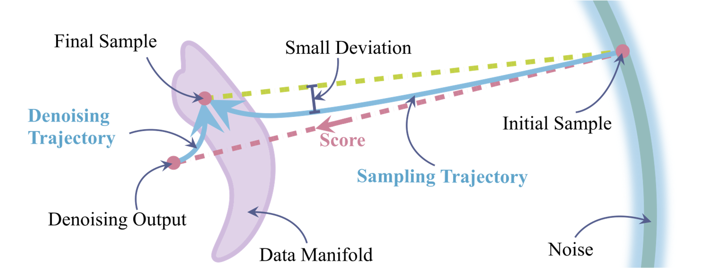
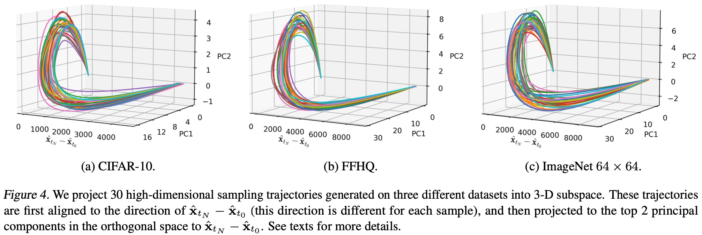
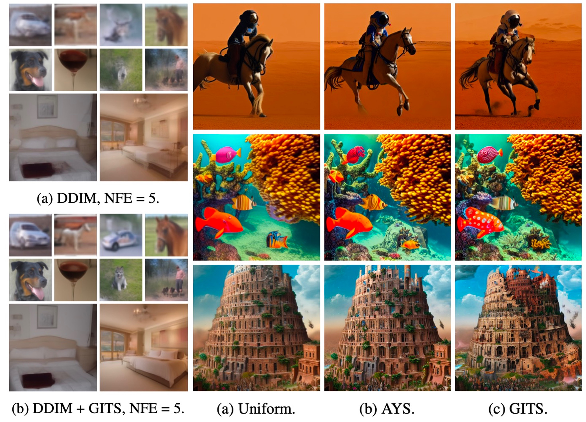
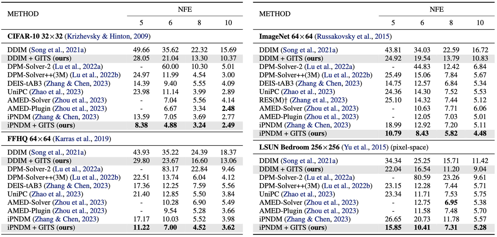

## On the Trajectory Regularity of ODE-based Diffusion Sampling<br><sub>Official implementation of the ICML 2024 paper</sub>



**On the Trajectory Regularity of ODE-based Diffusion Sampling**<br>
Defang Chen, Zhenyu Zhou, Can Wang, Chunhua Shen, Siwei Lyu
<br>https://arxiv.org/abs/2405.11326<br>

**TL;DR**: We illustrate the trajectory regularity that consistently appears in the ODE-based diffusion sampling, regardless of the specific content generated. We explain this regularity and develop a new fast sampling algorithm.

**Abstract**: Diffusion-based generative models use stochastic differential equations (SDEs) and their equivalent ordinary differential equations (ODEs) to establish a smooth connection between a complex data distribution and a tractable prior distribution. In this paper, we identify several intriguing trajectory properties in the ODE-based sampling process of diffusion models. We characterize an implicit denoising trajectory and discuss its vital role in forming the coupled sampling trajectory with a strong shape regularity, regardless of the generated content. We also describe a dynamic programming-based scheme to make the time schedule in sampling better fit the underlying trajectory structure. This simple strategy requires minimal modification to any given ODE-based numerical solvers and incurs negligible computational cost, while delivering superior performance in image generation, especially in $5\sim 10$ function evaluations. 



## Requirements
- This codebase mainly refers to the codebase of [EDM](https://github.com/NVlabs/edm). To install the required packages, please refer to the [EDM](https://github.com/NVlabs/edm) codebase.
- This codebase supports the pre-trained diffusion models from [EDM](https://github.com/NVlabs/edm), [ADM](https://github.com/openai/guided-diffusion), [Consistency models](https://github.com/openai/consistency_models), [LDM](https://github.com/CompVis/latent-diffusion) and [Stable Diffusion](https://github.com/CompVis/stable-diffusion). When you want to load the pre-trained diffusion models from these codebases, please refer to the corresponding codebases for package installation.

## Getting Started
Run the commands in [launch.sh](./launch.sh) for sampling and evaluation with recommended settings. 
All the commands can be parallelized across multiple GPUs by adjusting ```--nproc_per_node```. 
You can find the descriptions to all the parameters in the next section.
The required models will be downloaded at ```"./src/dataset_name"``` automatically. 
We use 4 A100 GPUs for all experiments. You can change the batch size based on your devices.

**Note**: `num_steps` is the number of timestamps. `num_steps=7` hence refers to 6 sampling steps. The effect of AFS here is different from that in [diff-solvers-main](../diff-solvers-main/). In GITS, when `afs=True`, we search for a new 'free' step between the first two timestamps and the total NFE is unchanged (but not for solvers like DPM-Solver-2 and Heun).

```.bash
# Generate a grid of 64 samples
SOLVER_FLAGS="--solver=ipndm --num_steps=7 --afs=False"
SCHEDULE_FLAGS="--schedule_type=polynomial --schedule_rho=7"
ADDITIONAL_FLAGS="--max_order=4"
GITS_FLAGS="--dp=True --metric=dev --coeff=1.15 --num_steps_tea=61"
python sample.py --dataset_name="cifar10" --batch=64 --seeds="0-63" --grid=True $SOLVER_FLAGS $SCHEDULE_FLAGS $ADDITIONAL_FLAGS $GITS_FLAGS
```

```.bash
# Generate samples for FID evaluation
SOLVER_FLAGS="--solver=ipndm --num_steps=7 --afs=False"
SCHEDULE_FLAGS="--schedule_type=polynomial --schedule_rho=7"
ADDITIONAL_FLAGS="--max_order=4"
GITS_FLAGS="--dp=True --metric=dev --coeff=1.15 --num_steps_tea=61"
torchrun --standalone --nproc_per_node=4 --master_port=22222 \
sample.py --dataset_name="cifar10" --batch=256 --seeds="0-49999" $SOLVER_FLAGS $SCHEDULE_FLAGS $ADDITIONAL_FLAGS $GITS_FLAGS
```

You can specify the time schedule directly with a list of timestamps (remember to delete space!)
```.bash
SOLVER_FLAGS="--solver=ipndm --afs=False"
SCHEDULE_FLAGS="--t_steps=[80,10.9836,3.8811,1.584,0.5666,0.1698,0.002]"
ADDITIONAL_FLAGS="--max_order=4"
python sample.py --dataset_name="cifar10" --batch=64 --seeds="0-63" --grid=True $SOLVER_FLAGS $SCHEDULE_FLAGS $ADDITIONAL_FLAGS
```

The generated images will be stored at ```"./samples"``` by default. To compute Fréchet inception distance (FID) for a given model and sampler, compare the generated images against the dataset reference statistics using ```fid.py```:
```.bash
# FID evaluation
python fid.py calc --images=path/to/images --ref=path/to/fid/stat
```

We also provide a script for calculating the CLIP score for Stable Diffusion with 30k images using the provided prompts:
```.bash
# CLIP score
python clip_score.py calc --images=path/to/images
```


## Description of Parameters
| Name | Paramater | Default | Description |
|------|-----------|---------|-------------|
|General options|dataset_name|None|One in ['cifar10', 'ffhq', 'afhqv2', 'imagenet64', 'lsun_bedroom', 'imagenet256', 'lsun_bedroom_ldm', 'ms_coco']|
|               |batch|64|Total batch size|
|               |seeds|0-63|Specify a different random seed for each image|
|               |grid|False|Organize the generated images as grid|
|SOLVER_FLAGS|solver|'ipndm'|Student solver. One in ['euler', 'ipndm', 'ipndm_v', 'heun', 'dpm', 'dpmpp', 'deis', 'unipc']|
|            |num_steps|7|Number of timestamps for the student solver|
|            |afs|False|Whether to use AFS which saves the first model evaluation. In GITS, if enable AFS, we search for a new 'free' step between the first two timestamps|
|            |denoise_to_zero|False|Whether to denoise from the last timestamp (>0) to 0. Require one more sampling step|
|SCHEDULE_FLAGS|schedule_type|'polynomial'|Time discretization schedule. One in ['polynomial', 'logsnr', 'time_uniform', 'discrete']|
|              |schedule_rho|7|Time step exponent. Need to be specified when schedule_type in ['polynomial', 'time_uniform', 'discrete']|
|ADDITIONAL_FLAGS|max_order|None|Option for multi-step solvers. 1<=max_order<=4 for iPNDM, iPNDM_v and DEIS, 1<=max_order<=3 for DPM-Solver++ and UniPC|
|                |predict_x0|True|Option for DPM-Solver++ and UniPC. Whether to use the data prediction formulation|
|                |lower_order_final|True|Option for DPM-Solver++ and UniPC. Whether to lower the order at the final stages of sampling|
|                |variant|'bh2'|Option for UniPC. One in ['bh1', 'bh2']|
|                |deis_mode|'tab'|Option for UniPC. One in ['tab', 'rhoab']|
|GUIDANCE_FLAGS|guidance_type|None|One in ['cg', 'cfg', 'uncond', None]. 'cg' for classifier-guidance, 'cfg' for classifier-free-guidance used in Stable Diffusion, and 'uncond' for unconditional used in LDM|
|              |guidance_rate|None|Guidance rate|
|              |prompt|None|Prompt for Stable Diffusion sampling|
|GITS_FLAGS|dp|False|Whether to use DP to search for an optimized schedule|
|          |metric|'dev'|Metric for calculating the cost matrix. One in ['dev', 'l1', 'l2']|
|          |coeff|1.15|Coefficient for the DP algorithm|
|          |num_warmup|256|Number of warmup samples for the DP algorithm|
|          |solver_tea|'ipndm'|Teacher solver. One in ['euler', 'ipndm', 'ipndm_v', 'heun', 'dpm', 'dpmpp', 'deis']|
|          |num_steps_tea|61|Number of timestamps for the teacher sampling trajectory|

## Performance




## Pre-trained Diffusion Models
We perform sampling on a variaty of pre-trained diffusion models from different codebases including
[EDM](https://github.com/NVlabs/edm), [ADM](https://github.com/openai/guided-diffusion), [Consistency models](https://github.com/openai/consistency_models), [LDM](https://github.com/CompVis/latent-diffusion) and [Stable Diffusion](https://github.com/CompVis/stable-diffusion). Supported pre-trained models are listed below:

| Codebase | dataset_name | Resolusion | Pre-trained Models | Description |
|----------|---------|------------|--------------------|-------------|
|EDM|cifar10|32|[edm-cifar10-32x32-uncond-vp.pkl](https://nvlabs-fi-cdn.nvidia.com/edm/pretrained/edm-cifar10-32x32-uncond-vp.pkl)
|EDM|ffhq|64|[edm-ffhq-64x64-uncond-vp.pkl](https://nvlabs-fi-cdn.nvidia.com/edm/pretrained/edm-ffhq-64x64-uncond-vp.pkl)
|EDM|afhqv2|64|[edm-afhqv2-64x64-uncond-vp.pkl](https://nvlabs-fi-cdn.nvidia.com/edm/pretrained/edm-afhqv2-64x64-uncond-vp.pkl)
|EDM|imagenet64|64|[edm-imagenet-64x64-cond-adm.pkl](https://nvlabs-fi-cdn.nvidia.com/edm/pretrained/edm-imagenet-64x64-cond-adm.pkl)
|Consistency Models|lsun_bedroom|256|[edm_bedroom256_ema.pt](https://openaipublic.blob.core.windows.net/consistency/edm_bedroom256_ema.pt)|Pixel-space
|ADM|imagenet256|256|[256x256_diffusion.pt](https://openaipublic.blob.core.windows.net/diffusion/jul-2021/256x256_diffusion.pt) and [256x256_classifier.pt](https://openaipublic.blob.core.windows.net/diffusion/jul-2021/256x256_classifier.pt)|Classifier-guidance.
|LDM|lsun_bedroom_ldm|256|[lsun_bedrooms.zip](https://ommer-lab.com/files/latent-diffusion/lsun_bedrooms.zip)|Latent-space
|LDM|ffhq_ldm|256|[ffhq.zip](https://ommer-lab.com/files/latent-diffusion/ffhq.zip)|Latent-space
|Stable Diffusion|ms_coco|512|[stable-diffusion-v1-5](https://huggingface.co/runwayml/stable-diffusion-v1-5/resolve/main/v1-5-pruned-emaonly.ckpt)|Classifier-free-guidance


## FID Statistics
For facilitating the FID evaluation of diffusion models, we provide our [FID statistics](https://drive.google.com/drive/folders/1f8qf5qtUewCdDrkExK_Tk5-qC-fNPKpL?usp=sharing) of various datasets. They are collected on the Internet or made by ourselves with the guidance of the [EDM](https://github.com/NVlabs/edm) codebase. 

You can compute the reference statistics for your own datasets as follows:
```
python fid.py ref --data=path/to/my-dataset.zip --dest=path/to/save/my-dataset.npz
```

## Citation
If you find this repository useful, please consider citing the following paper:

```
@article{chen2024trajectory,
  title={On the Trajectory Regularity of ODE-based Diffusion Sampling},
  author={Chen, Defang and Zhou, Zhenyu and Wang, Can and Shen, Chunhua and Lyu, Siwei},
  journal={arXiv preprint arXiv:2405.11326},
  year={2024}
}
```
