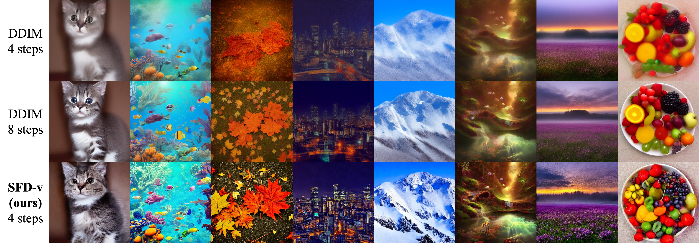
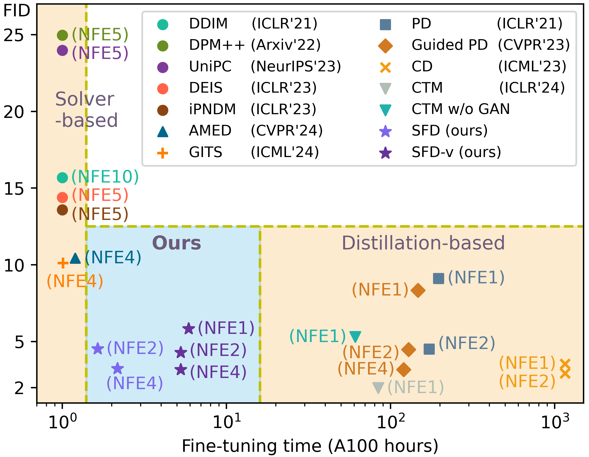
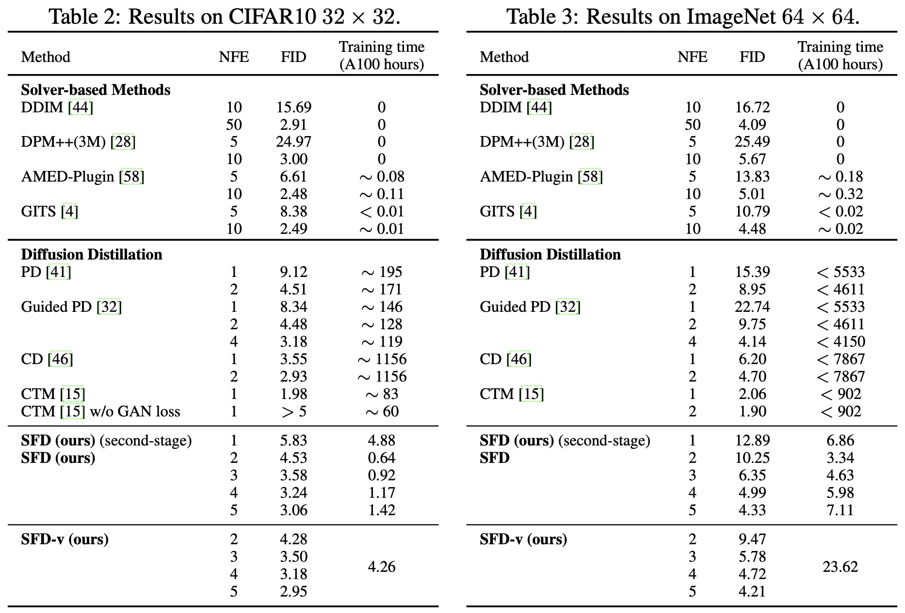

## Simple and Fast Distillation of Diffusion Models <br><sub>Official implementation of the NeurIPS 2024 paper</sub>



**Simple and Fast Distillation of Diffusion Models**<br>
Zhenyu Zhou, Defang Chen, Can Wang, Chun Chen, Siwei Lyu
<br>https://arxiv.org/abs/2409.19681<br>

**TL;DR**: A simple and fast distillation of diffusion models that accelerates the fine-tuning up to 1000 times while performing high-quality image generation.

**Abstract**: Diffusion-based generative models have demonstrated their powerful performance across various tasks, but this comes at a cost of the slow sampling speed. To achieve both efficient and high-quality synthesis, various distillation-based accelerated sampling methods have been developed recently. However, they generally require time-consuming fine tuning with elaborate designs to achieve satisfactory performance in a specific number of function evaluation (NFE), making them difficult to employ in practice. To address this issue, we propose **S**imple and **F**ast **D**istillation (SFD) of diffusion models, which simplifies the paradigm used in existing methods and largely shortens their fine-tuning time up to 1000 times. We begin with a vanilla distillation-based sampling method and boost its performance to state of the art by identifying and addressing several small yet vital factors affecting the synthesis efficiency and quality. Our method can also achieve sampling with variable NFEs using a single distilled model. Extensive experiments demonstrate that SFD strikes a good balance between the sample quality and fine-tuning costs in few-step image generation task. For example, SFD achieves 4.53 FID (NFE=2) on CIFAR-10 with only **0.64 hours** of fine-tuning on a single NVIDIA A100 GPU. 



## Requirements
- This codebase mainly refers to the codebase of [EDM](https://github.com/NVlabs/edm). To install the required packages, please refer to the [EDM](https://github.com/NVlabs/edm) codebase.
- This codebase supports the pre-trained diffusion models from [EDM](https://github.com/NVlabs/edm), [LDM](https://github.com/CompVis/latent-diffusion) and [Stable Diffusion](https://github.com/CompVis/stable-diffusion). When you want to load the pre-trained diffusion models from these codebases, please refer to the corresponding codebases for package installation.

## Getting Started
Run the commands in [launch.sh](./launch.sh) for training, sampling and evaluation with recommended settings. 
You can find the descriptions to the main parameters in the next section.
The required models will be downloaded at ```"./src/dataset_name"``` automatically. 
We use 4 A100 GPUs for all experiments. You can change the batch size based on your devices.

**Note**: `num_steps` is the number of timestamps (sampling steps + 1). `num_steps=4` hence refers to 3 sampling steps. The use of AFS saves 1 step, so (`num_steps=4` with `afs=False`) equals 3 sampling steps and (`num_steps=4` with `afs=True`）equals 2 sampling steps.

### Training
```.bash
# Train a 2-NFE SFD (useable for EDM models trained on cifar10, ffhq, afvqv2 and imagenet64)

torchrun --standalone --nproc_per_node=4 --master_port=12345 train.py \
--dataset_name="cifar10" --total_kimg=200 --batch=128 --lr=5e-5 \
--num_steps=4 --M=3 --afs=True --sampler_tea="dpmpp" --max_order=3 --predict_x0=True --lower_order_final=True \
--schedule_type="polynomial" --schedule_rho=7 --use_step_condition=False --is_second_stage=False
```

```.bash
# Train SFD-v (NFE-variable version, allow sampling for num_steps within 4 to 7, a.k.a. NFE within 2 to 5, using one model)

torchrun --standalone --nproc_per_node=4 --master_port=12345 train.py \
--dataset_name="cifar10" --total_kimg=800 --batch=128 --lr=5e-5 \
--num_steps=4 --M=3 --afs=True --sampler_tea="dpmpp" --max_order=3 --predict_x0=True --lower_order_final=True \
--schedule_type="polynomial" --schedule_rho=7 --use_step_condition=True --is_second_stage=False

```

### Sampling
After training, the distilled SFD model will be saved at "./exps" with a five digit experiment number (e.g. 00000). 
The settings for sampling are stored in the model file. You can perform accelerated sampling with SFD by giving the file path or the experiment digit number (e.g. 0) to `--model_path`.

```.bash
# Sample 50k images using SFD for FID evaluation

torchrun --standalone --nproc_per_node=4 --master_port=12345 sample.py \
--dataset_name='cifar10' --model_path=0 --seeds='0-49999' --batch=256
```

```.bash
# Sample 50k images using SFD-v for FID evaluation
# When use_step_condition=True is used for distillation, set a specific num_steps during sampling

torchrun --standalone --nproc_per_node=4 --master_port=12345 sample.py \
--dataset_name='cifar10' --model_path=0 --seeds='0-49999' --batch=256 --num_steps=4
```

### Evaluation
To compute Fréchet inception distance (FID), compare the generated images against the dataset reference statistics:
```.bash
# FID evaluation

python fid.py calc --images="path/to/generated/images" --ref="path/to/fid/stat"
```

We also provide a script for calculating precision, recall, density and coverage. The reference images for CIFAR-10 (cifar10-32x32.zip) can be found [here](https://drive.google.com/file/d/196tB1pdpFzZ4cAuHxF_p46P1Aw37bUHz/view?usp=drive_link).
```.bash
# Precision, recall, density and coverage

python prdc.py calc --images="path/to/generated/images" --images_ref="path/to/reference/images"
```


## Description of Parameters
| Paramater | Default | Description |
|-----------|---------|-------------|
|dataset_name|None|One in ['cifar10', 'ffhq', 'afhqv2', 'imagenet64', 'lsun_bedroom', 'lsun_bedroom_ldm', 'ms_coco']|
|total_kimg|200|How many sampling trajectories to be trained (x1000)|
|batch|128|Total batch size|
|lr|5e-5|Learning rate|
|num_steps|4|Number of timestamps for the student solver|
|M|3|How many timestamps to be inserted into every two adjacent timestamps in the original schedule. The $K$ used in our paper equals M+1.|
|afs|True|Whether to use AFS which saves the first model evaluation.|
|sampler_tea|'dpmpp'|Teacher solver. One in ['dpm', 'dpmpp', 'euler', 'ipndm', 'heun']|
|max_order|None|Option for multi-step solvers. 1<=max_order<=4 for iPNDM 1<=max_order<=3 for DPM-Solver++|
|predict_x0|True|Option for DPM-Solver++. Whether to use the data prediction formulation|
|lower_order_final|True|Option for DPM-Solver++. Whether to lower the order at the final stages of sampling|
|schedule_type|'polynomial'|Time discretization schedule. One in ['polynomial', 'logsnr', 'time_uniform', 'discrete']|
|schedule_rho|7|Time step exponent. Need to be specified when schedule_type in ['polynomial', 'time_uniform', 'discrete']|
|use_step_condition|False|Whether to add step condition into the model to obtain a NFE-variable model|
|is_second_stage|False|Whether to perform second-stage distillation to obtain a 1-NFE model|
|model_path|None|When is_second_stage=True, should be the path to a SFD or SFD-v model|

## Performance


## Pre-trained Diffusion Models
We perform sampling on a variaty of pre-trained diffusion models from different codebases including
[EDM](https://github.com/NVlabs/edm), [LDM](https://github.com/CompVis/latent-diffusion) and [Stable Diffusion](https://github.com/CompVis/stable-diffusion). Supported pre-trained models are listed below:

| Codebase | dataset_name | Resolusion | Pre-trained Models | Description |
|----------|---------|------------|--------------------|-------------|
|EDM|cifar10|32|[edm-cifar10-32x32-uncond-vp.pkl](https://nvlabs-fi-cdn.nvidia.com/edm/pretrained/edm-cifar10-32x32-uncond-vp.pkl)
|EDM|ffhq|64|[edm-ffhq-64x64-uncond-vp.pkl](https://nvlabs-fi-cdn.nvidia.com/edm/pretrained/edm-ffhq-64x64-uncond-vp.pkl)
|EDM|afhqv2|64|[edm-afhqv2-64x64-uncond-vp.pkl](https://nvlabs-fi-cdn.nvidia.com/edm/pretrained/edm-afhqv2-64x64-uncond-vp.pkl)
|EDM|imagenet64|64|[edm-imagenet-64x64-cond-adm.pkl](https://nvlabs-fi-cdn.nvidia.com/edm/pretrained/edm-imagenet-64x64-cond-adm.pkl)
|LDM|lsun_bedroom_ldm|256|[lsun_bedrooms.zip](https://ommer-lab.com/files/latent-diffusion/lsun_bedrooms.zip)|Latent-space
|LDM|ffhq_ldm|256|[ffhq.zip](https://ommer-lab.com/files/latent-diffusion/ffhq.zip)|Latent-space
|Stable Diffusion|ms_coco|512|[stable-diffusion-v1-5](https://huggingface.co/runwayml/stable-diffusion-v1-5/resolve/main/v1-5-pruned-emaonly.ckpt)|Classifier-free-guidance


## FID Statistics
For facilitating the FID evaluation of diffusion models, we provide our [FID statistics](https://drive.google.com/drive/folders/1f8qf5qtUewCdDrkExK_Tk5-qC-fNPKpL?usp=sharing) of various datasets. They are collected on the Internet or made by ourselves with the guidance of the [EDM](https://github.com/NVlabs/edm) codebase. 

You can compute the reference statistics for your own datasets as follows:
```
python fid.py ref --data=path/to/my-dataset.zip --dest=path/to/save/my-dataset.npz
```

## Citation
If you find this repository useful, please consider citing the following paper:

```
@article{chen2024trajectory,
  title={On the Trajectory Regularity of ODE-based Diffusion Sampling},
  author={Chen, Defang and Zhou, Zhenyu and Wang, Can and Shen, Chunhua and Lyu, Siwei},
  journal={arXiv preprint arXiv:2405.11326},
  year={2024}
}
```
